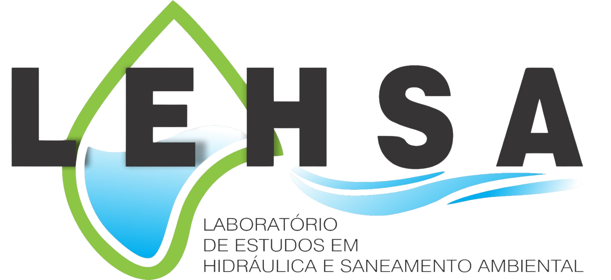

 
<h3 align="center">

</h3>
 

 <a href="#-lehsa---gerenciador-de-laboratórios">Sobre</a> •
 <a href="#-alunos-integrantes-da-equipe">Integrantes</a> • 
 <a href="#-professores-responsáveis">Professores</a> • 
 <a href="#-tecnologias">Tecnologias</a> • 
 <a href="#-instruções-de-utilização">Instruções de Utilização</a>  

# 🧪 LEHSA - Gerenciador de Laboratórios

O sistema LEHSA é destinado
ao gerenciamento do Laboratório de Estudos em Hidráulica e Saneamento Ambiental
(LEHSA) no Instituto Federal de Sergipe (IFS). Diante da falta de robustez nos sistemas
atuais, que ainda se apoiam fortemente em métodos analógicos como planilhas de Excel, papel e comunicacão direta entre os envolvidos, a digitalizacão se apresenta como
resposta vital. Essa transição tornou-se não apenas desejável, mas uma necessidade essencial,à medida que as responsabilidades e dependências do laboratório cresceram, tornando a abordagem tradicional insustentável

## 🧑‍🏫 Alunos integrantes da equipe

* [Lucas Cabral Soares](https://github.com/lcsoares2022)
* [Lucas Hemétrio Teixeira](https://github.com/lucasht02)
* [Lucca Oliveira Vasconcelos de Faria](https://github.com/luccaovf)
* [Maria Eduarda Amaral Muniz](https://github.com/duda-amaral)
* [Vítor Lagares Stahlberg](https://github.com/VitorLS0)

## 👩‍💻 Professores responsáveis

* Lucila Ishitani
* Soraia Lúcia da Silva

## 🚀 Tecnologias

- Frontend:

    - [Next.js](https://nextjs.org/)
    - [shadcn/ui](https://ui.shadcn.com/)
    - [Tailwind CSS](https://tailwindcss.com/)
    - [JavaScript](https://www.javascript.com/)
    - [Typescript](https://www.typescriptlang.org/)

- Backend

    - [Java](https://www.java.com/pt-BR/)
    - [Lombok](https://projectlombok.org/)
    - [Spring Boot](https://spring.io/projects/spring-boot)
    - [Spring Security](https://spring.io/projects/spring-security)

- Database:

    - [PostgreSQL](https://www.postgresql.org/)
    - [PgAdmin](https://www.pgadmin.org/)

## 💻 Instruções de utilização

**Passo 01: baixar e descompactar o arquivo .zip do repositório**

Baixe o arquivo .zip do repositório, descompacte o arquivo e abra na sua IDE de preferência. Durante o desenvolvimento foi usado Intellij para o Back-end e Visual Studio Code para o Front-end.

**Passo 02: configurar e iniciar o Back-end**

- Passo 2.1: configurar a IDE para usar a SDK do Java 17.
- Passo 2.2: inicializar o Main do Back-end.

**Passo 03: instalar e iniciar o Front-end via linha de comando**

- Passo 3.1: acesse a pasta do Front-end pelo terminal.
- Passo 3.2: instalar as dependências: `npm install`.
- Passo 3.3: iniciar aplicação frontend: `npm run dev`.

A aplicação Front-end vai estar rodando em <http://localhost:4200/>.

**Passo 04: configurar o banco de dados PostgreSQL**

Um banco de dados PostgreSQL deve estar criado com o nome de "gerenciador-lehsa" e um usuário admin para que o sistema seja inicializado com sucesso.

**Passo 05: criando conta de admin**

- Passo 5.1: abra a sua ferramenta de administração do PostgreSQL.
- Passo 5.2: vá no seu banco de dados `gerenciador-lehsa` e selecione para visualizar a tabela `tb_usuario`.
- Passo 5.3: na coluna `perfil_usuario`, escolha algum usuário e troque de 2 para 1.
  
Agora você tem um administrador cadastrado e pode acessar a página do admin.

**Uso do sistema**

A página inicial é um login com email e senha. Uma conta admin pode preencher os dados e começar a usar o sistema. Após fazer o login, você será redirecionado para a tela de Itens, onde todos os equipamentos e materiais do laboratório estarão aparecendo. Na direita superior da tela tem o botão para adicionar novos Itens; é só clicar no botão, preencher os dados do formulário e o Item estará disponível para acesso na página principal. No menu à esquerda, há opções de navegação dentro do sistema. Em agendamentos, você pode ver os agendamentos feitos por outros usuários e aceitar ou recusar a solicitação; o mesmo se aplica para empréstimos. Na aba de usuários, todas as pessoas cadastradas no sistema estarão disponíveis para visualização.

Caso não possua uma conta admin, é possível fazer um cadastro para acessar a funcionalidade de agendamento e empréstimo de equipamentos do laboratório. Basta selecionar um Item disponível e preencher o formulário. O admin receberá sua solicitação e você saberá a resposta dentro de alguns dias.

